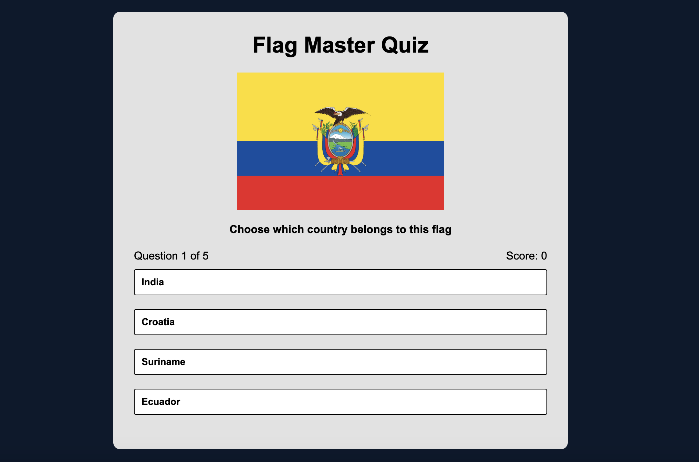

# Flag Master Quiz 

## A fully functional country flag quiz project built with HTML, CSS, and JavaScript, integrated with the REST Countries API. Explore how to create an engaging quiz experience. 

### Live Demo

Check out the live demo: [My Awesome App on Netlify](https://your-netlify-app-name.netlify.app/)

The Flag Master Quiz is a web-based application that challenges users to identify countries based on their flags. This interactive quiz features a user-friendly interface, engaging questions, and real-time feedback on the user's performance.

**Dynamic Quiz Questions:** The quiz fetches country data from the [restcountries.com](https://restcountries.com/v2/all) API, ensuring a diverse set of questions.

- **Responsive Design:** The application is designed to work seamlessly across various screen sizes, providing an optimal user experience on both desktop and mobile devices.

- **Scoring System:** Users receive instant feedback on their answers, with a running score displayed on the screen. The final score is presented at the end of the quiz.

- **Play Again Option:** Upon completing the quiz, users have the option to play again, restarting the quiz with a new set of questions. 

- **Answer Shuffling:** To enhance the challenge, the answer choices are dynamically shuffled for each question, preventing users from memorizing the order.

- **Visual Feedback:** The styling of answer buttons changes based on user responses, providing a visual cue for correct and incorrect answers.

## Technologies Used

- **HTML:** Structuring the web page.
- **CSS:** Styling the user interface for an attractive and responsive design.
- **JavaScript:** Implementing the quiz logic and interactivity.
- **REST Countries API:** Retrieving country data for quiz questions.

## Installation

1. Clone this repository.
2. Open the `index.html` file in a web browser.
3. Start the quiz and enjoy testing your knowledge of country flags!

## Screenshots

## Contributing

Contributions are welcome! Please follow the guidelines in [CONTRIBUTING.md](CONTRIBUTING.md).

## License

This project is licensed under the [MIT License](LICENSE).
